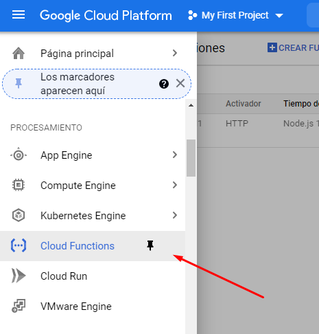
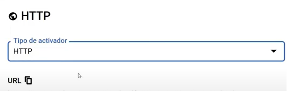
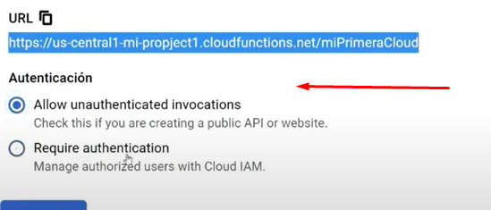
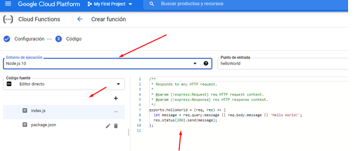
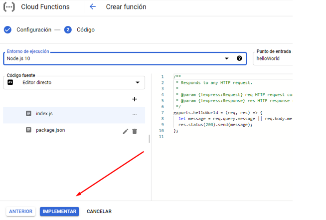
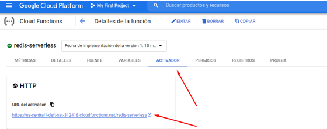

# Manual Tecnico

## Table of contents
- [Manual Tecnico](#manual-tecnico)
  - [Table of contents](#table-of-contents)
  - [Introduccion](#introduccion)
  - [Objetivos](#objetivos)
  - [Arquitectura utilizada](#arquitectura-utilizada)
  - [Locust](#locust)
    - [Comando para instalar](#comando-para-instalar)
    - [Como correr Locust](#como-correr-locust)
    - [se abre una ventana en el navegador locahot:8089](#se-abre-una-ventana-en-el-navegador-locahot8089)
    - [si se quiere indicar el url, numero de usuarios, spawn rate es con el siguiente comando](#si-se-quiere-indicar-el-url-numero-de-usuarios-spawn-rate-es-con-el-siguiente-comando)
  - [GRPC](#grpc)
    - [Cosas necesarias por si se desea modificar el proto en la carpeta infectedpb](#cosas-necesarias-por-si-se-desea-modificar-el-proto-en-la-carpeta-infectedpb)
      - [Instalar proto y clang-format para esto hacemos lo siguiente](#instalar-proto-y-clang-format-para-esto-hacemos-lo-siguiente)
      - [si se desea generar de nuevo el proto si modificaste algo en el archivo solo basta con ejecutar el script](#si-se-desea-generar-de-nuevo-el-proto-si-modificaste-algo-en-el-archivo-solo-basta-con-ejecutar-el-script)
    - [Pasos para instalar Grpc y todo lo necesario y poder ejecutar el archivo sin problemas esto es opcional ahora, ya que se agregaron los archivos .mod y .sum que estos descargan automaticamente las dependencias.](#pasos-para-instalar-grpc-y-todo-lo-necesario-y-poder-ejecutar-el-archivo-sin-problemas-esto-es-opcional-ahora-ya-que-se-agregaron-los-archivos-mod-y-sum-que-estos-descargan-automaticamente-las-dependencias)
    - [Con todo esto ya puedes ejecutar el servidor y cliente de gRPC con locust. solo hace falta agregar que se puede comunicar al backend y ver lo de load balancer.](#con-todo-esto-ya-puedes-ejecutar-el-servidor-y-cliente-de-grpc-con-locust-solo-hace-falta-agregar-que-se-puede-comunicar-al-backend-y-ver-lo-de-load-balancer)
    - [Se agrego los archivos docker y docker-compose como ejecutarlo? bueno ingresamos a la carpeta infected_server y introducimos el siguiente comando.](#se-agrego-los-archivos-docker-y-docker-compose-como-ejecutarlo-bueno-ingresamos-a-la-carpeta-infected_server-y-introducimos-el-siguiente-comando)
    - [de manera similar lo hacemos para el cliente](#de-manera-similar-lo-hacemos-para-el-cliente)
    - [Se crearon los archivos de manifiesto quedando de la siguiente manera esto se utilizaron para kubernetes](#se-crearon-los-archivos-de-manifiesto-quedando-de-la-siguiente-manera-esto-se-utilizaron-para-kubernetes)
      - [Deployment](#deployment)
      - [Service](#service)
  - [REDIS](#redis)
    - [Publisher](#publisher)
      - [Deployment](#deployment-1)
      - [Service](#service-1)
    - [Suscriber](#suscriber)
      - [Deployment](#deployment-2)
      - [Service](#service-2)
  - [Google Cloud Run](#google-cloud-run)
    - [Para configurar google cloud run se creo el siguiente dockerfile](#para-configurar-google-cloud-run-se-creo-el-siguiente-dockerfile)
    - [Una vez creado el dockerfile se usaron los siguientes comandos.](#una-vez-creado-el-dockerfile-se-usaron-los-siguientes-comandos)
    - [En la pagina registry container muestra la imagen](#en-la-pagina-registry-container-muestra-la-imagen)
    - [En google cloud run se da crear servicio y se realiza la siguiente configuracion.](#en-google-cloud-run-se-da-crear-servicio-y-se-realiza-la-siguiente-configuracion)
    - [En el puerto es de suma importancia que se ponga la del contenedor en este caso como es un servidor de NGINX, por default es el 80 por lo que se coloca este puerto.](#en-el-puerto-es-de-suma-importancia-que-se-ponga-la-del-contenedor-en-este-caso-como-es-un-servidor-de-nginx-por-default-es-el-80-por-lo-que-se-coloca-este-puerto)
  - [Serverless-Functions](#Serverless-Functions)
  - [Bibliografia](#bibliografia)

## Introduccion 

Dada la situación actual, con la pandemia COVID-19, se require hacer un análisis en tiempo real de los datos de 
las personas que se han colocado la vacuna a nivel mundial. Por ello, es necesario realizar un sistema que pueda almacenar los datos
de las personas que se han vacunado y mostrar gráficas relevantes; así tomar mejor decisiones en la búsqueda de métodos para
sobrellevar la contingencia de la mejor manera.

El sistema contará con una carga masiva de datos, los cuales tendrán un formato específico detallado más
adelante; además, contarán con una app web que mostrará las gráficas y métricas más relevantes de los datos
que se suministren al sistema, ademas realizara un analisis de como se comporta los datos cuando llegan a la app web esto utilizando la herramienta de linkerd y Chaos Engineering.

Se utilizarán tres alternativas de middlewares de mensajería; cada uno de ellos será utilizado para enviar el
tráfico generado en conjunto, esto con el fin de tener una respuesta más rápida al momento de cargar datos,
además de utilizar tecnología de vanguardia para sobrellevar este sistema.

## Objetivos 

1. Comprender la teoría de la concurrencia y el paralelismo para desarrollar sistemas distribuidos.
2. Experimentar y probar con las tecnologías Cloud Native útiles para desarrollar sistemas distribuidos modernos.
3. Diseñar estrategias de sistemas distribuidos para mejorar la respuesta de alta concurrencia.
4. Monitorear procesos distribuidos utilizando tecnologías asociadas a la observabilidad y la telemetría.
5. Implementar contenedores y orquestadores en sistemas distribuidos.
6. Medir la fidelidad y el desempeño en sistemas con alta disponibilidad.
7. Implementar la Chaos Engineering.

## Arquitectura utilizada 

## Locust 

### Comando para instalar
    pip3 install locust

### Como correr Locust 
    locust -f filename.py 
### se abre una ventana en el navegador locahot:8089 

### si se quiere indicar el url, numero de usuarios, spawn rate es con el siguiente comando
    locust -f traffic.py -u 1 -r 1 --host url 

## GRPC 

### Cosas necesarias por si se desea modificar el proto en la carpeta infectedpb

#### Instalar proto y clang-format para esto hacemos lo siguiente 

    sudo apt-get install clang-format 

    curl -OL https://github.com/google/protobuf/releases/download/v3.5.1/protoc-3.5.1-linux-x86_64.zip

    unzip protoc-3.5.1-linux-x86_64.zip -d protoc3

    sudo mv protoc3/bin/* /usr/local/bin/

    sudo mv protoc3/include/* /usr/local/include/

    sudo chown [YourUser] /usr/local/bin/protoc
    
    sudo chown -R [YourUser] /usr/local/include/google

#### si se desea generar de nuevo el proto si modificaste algo en el archivo solo basta con ejecutar el script 

### Pasos para instalar Grpc y todo lo necesario y poder ejecutar el archivo sin problemas esto es opcional ahora, ya que se agregaron los archivos .mod y .sum que estos descargan automaticamente las dependencias.

    go get -u google.golang.org/grpc
    go get -u github.com/golang/protobuf/{proto,protoc-gen-go}
    go get -u github.com/gorilla/mux

### Con todo esto ya puedes ejecutar el servidor y cliente de gRPC con locust. solo hace falta agregar que se puede comunicar al backend y ver lo de load balancer.

### Se agrego los archivos docker y docker-compose como ejecutarlo? bueno ingresamos a la carpeta infected_server y introducimos el siguiente comando.
    docker build -t nameimage:version . 
    docker build -t server:v1 . 
### de manera similar lo hacemos para el cliente 
    docker build -t client:v1 

### Se crearon los archivos de manifiesto quedando de la siguiente manera esto se utilizaron para kubernetes 

#### Deployment 

#### Service 

## REDIS 

Para la utilizacion de este servicio se tuvo que instalar en el cluster lo que es redis, para ello se hizo uso del siguiente archivo yaml 

Es importante que el servicio sea de tipo NodePort o de LoadBalancer, pero como google cloud, no da para tener un maximo de 4 LoadBalancer se escojio de tipo NodePort

### Publisher 

Para el publisher se utilizo la siguiente configuracion en go 

los archivos manifiest utilizados para kubernetes se dejan a continuacion 

#### Deployment 

#### Service

### Suscriber 
Para el suscriber se realizo la siguiente configuracion en go 

los archivos manifiest utilizados para kubernetes se dejan a continuacion 

#### Deployment 

#### Service 

## Google Cloud Run 
### Para configurar google cloud run se creo el siguiente dockerfile 

### Una vez creado el dockerfile se usaron los siguientes comandos. 
    docker build -t fronted:prod .
melodic-arcadia-308307: es el id del proyecto de google cloud

    docker tag fronted:prod gcr.io/melodic-arcadia-308307/fronted:v1.0.2
    docker push gcr.io/melodic-arcadia-308307/fronted
Para que funcionen sin problema estos comandos debemos estar logueados en nuestro sistema operativo con GCP 

### En la pagina registry container muestra la imagen 

### En google cloud run se da crear servicio y se realiza la siguiente configuracion. 

### En el puerto es de suma importancia que se ponga la del contenedor en este caso como es un servidor de NGINX, por default es el 80 por lo que se coloca este puerto.

## Serverless-Functions

Es considerado un Faas, se pueden implementar lenguajes como Python, Js, Go, entre otros.
Se utilizó GCP para la creación de las serverless functions, en el apartado de cloud functions

Se hace uso del activador porque una cloud function está basada en eventos que pueden ser internos o externos, HTTP es un servicio y es un evento externo, que alguien más activa, que un cliente hace una petición, es como un backend con una cloud function.

En este caso permitimos el acceso de todos lados, a cada función se le puede asignar memoria, un tiempo de espera, la cuenta, en este caso lo dejamos como app engine para que le acceso a todos.

Tenemos el entorno de ejecución, tenemos el index.js que es el cloud función en sí, y el package.json que es lo necesario para que jale.

Le damos en implementar para poner en marcha la cloud function

Tenemos un activador de la función, gracias a ese activador (definimos que sería un http) la función se disparará y se ejecutará el contenido de ella.

## Bibliografia
1. Albornoz, D. (9 de septiembre de 2020). Cómo instalar y configurar Docker en Ubuntu 18.04. Recuperado el 19 de octubre de 2020, de https://www.hostinger.es/tutoriales/comoinstalar-y-usar-docker-en-ubuntu/
2. Castillo, J. A. (5 de noviembre de 2018). Qué es la virtualización y para qué sirve. Recuperado el 19 de octubre de 2020, de https://www.profesionalreview.com/2018/11/05/que-esvirtualizacion/
3. Docker. (s.f.). Recuperado el 19 de octubre de 2020, de https://www.docker.com/
4. Hypervisor: el medio para la virtualización. (06 de agosto de 2020). Recuperado el 19 de octubre de 2020, de https://www.ionos.es/digitalguide/servidores/know-how/que-esun-hypervisor/
5. Pacheco Mengual, J. (29 de julio de 2015). Docker for dummies. Recuperado el 19 de octubre de 2020, de https://www.adictosaltrabajo.com/2015/07/29/docker-for-dummies/
